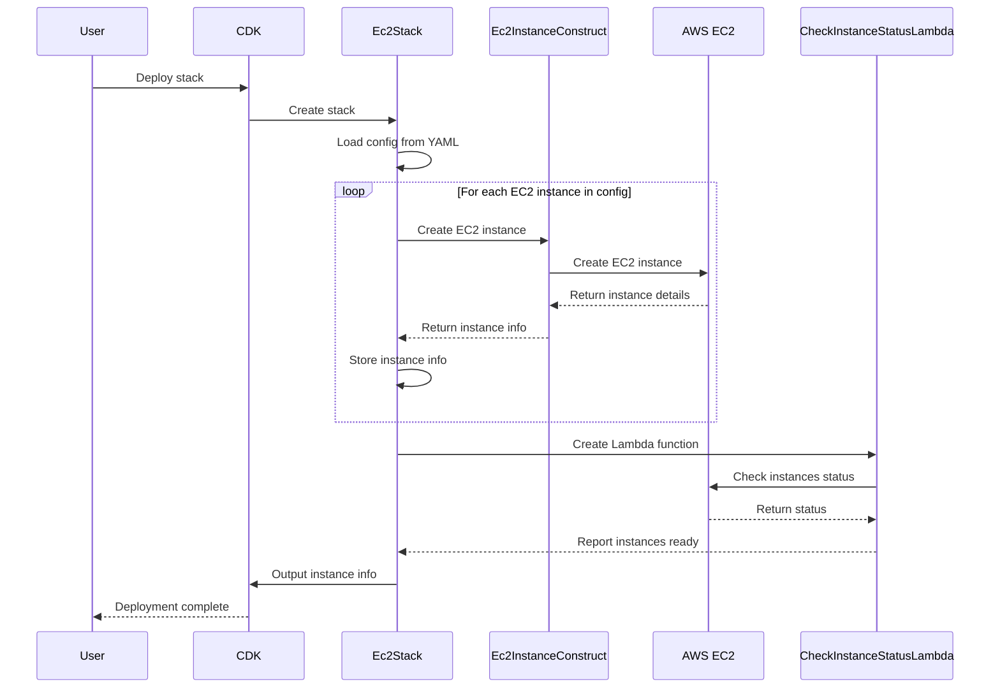

# AWS CLI Automation Utils

## Project Overview

This project leverages AWS CDK with TypeScript to automate cloud resource provisioning and management. It streamlines environment setup and management in AWS, with a focus on EC2 instance deployment and configuration.



## Prerequisites

Ensure the following are installed on your system:

1. **Python** (3.9.x or above)
2. **Node.js** (latest LTS version)
3. **NPM** (comes with Node.js)
4. **AWS CLI** (latest version)
5. **AWS CDK CLI** (latest version)
6. **AWS Session Manager Plugin**
7. **jq**

## Installation

### Install aws-cdk

Install the latest version of AWS CDK, but it's generally better to specify a version to ensure consistency across team members and deployments. Here are the options:

```bash
# For latest version:
npm install -g aws-cdk

# For a specific version (recommended):
npm install -g aws-cdk@2.99.1  # Replace with your desired version

# To check your currently installed version:
cdk --version
```

### AWS Account Setup

1. Configure AWS SSO (if using SSO):
```bash
aws configure sso
```

2. Test your AWS access:
```bash
aws s3 ls --profile your-profile-name
```

### Project Setup

1. Clone the repository:
```bash
git clone https://github.com/schmitech/aws-cli-automation-utils.git
cd aws-cli-automation-utils
```

2. Install project dependencies:
```bash
npm install
```

## Usage

### Deploying EC2 Instances

1. Configure your instances in `ec2-config.yaml`:
   - Set AMI IDs
   - Configure instance types and other parameters

2. Bootstrap CDK:
```bash
./cdk-bootstrap.sh your-profile-name
```

3. Synthesize and deploy:
```bash
cdk synth
./cdk-deploy.sh your-profile-name
```

### Verification

1. Check EC2 instance status:
```bash
./list-ec2.sh your-profile-name | grep running
```

2. Test instance connectivity:
```bash
aws ssm start-session --target i-1234567 --profile your-profile-name
```

### Target Group Management

To register an instance with a target group:

1. List target groups:
```bash
./describe-target-groups.sh your-profile-name instance-name
```

2. Register an instance:
```bash
./register-target.sh your-profile-name target-group-arn instance-id port-number
```

## Cleanup
Remove the stack and resources:
```bash
./cdk-destroy.sh your-profile-name
```

### Manual Cleanup Required

1. **EBS Volumes**: 
   - Delete any remaining EBS volumes via EC2 Console

2. **S3 Bucket**: 
   - Empty and delete the bootstrap bucket

### Verification
- Confirm CloudFormation stack deletion
- Check for remaining EC2 instances
- Review and remove any remaining EBS volumes
- Verify bootstrap S3 bucket deletion

## Maintenance

1. Update dependencies:
```bash
npm update
```

2. Review and update `ec2-config.yaml` as needed

## Troubleshooting

Common issues and solutions:

1. **CDK Deployment Issues**
   - Verify AWS credentials and permissions
   - Check CloudFormation events in AWS Console
   - Ensure latest CDK version is installed

2. **EC2 Connectivity Issues**
   - Verify VPC and security group settings
   - Check instance status
   - Confirm Systems Manager Agent is running

3. **AWS SSO Issues**
   - Clear browser cache
   - Verify SSO credentials
   - Check session expiration

## Contributing

Contributions are welcome! Please feel free to submit a Pull Request.

## License

Licensed under the Apache License, Version 2.0 (the "License");
you may not use this file except in compliance with the License.
You may obtain a copy of the License at

    http://www.apache.org/licenses/LICENSE-2.0

Unless required by applicable law or agreed to in writing, software
distributed under the License is distributed on an "AS IS" BASIS,
WITHOUT WARRANTIES OR CONDITIONS OF ANY KIND, either express or implied.
See the License for the specific language governing permissions and
limitations under the License.

Copyright 2024 Schmitech Inc.