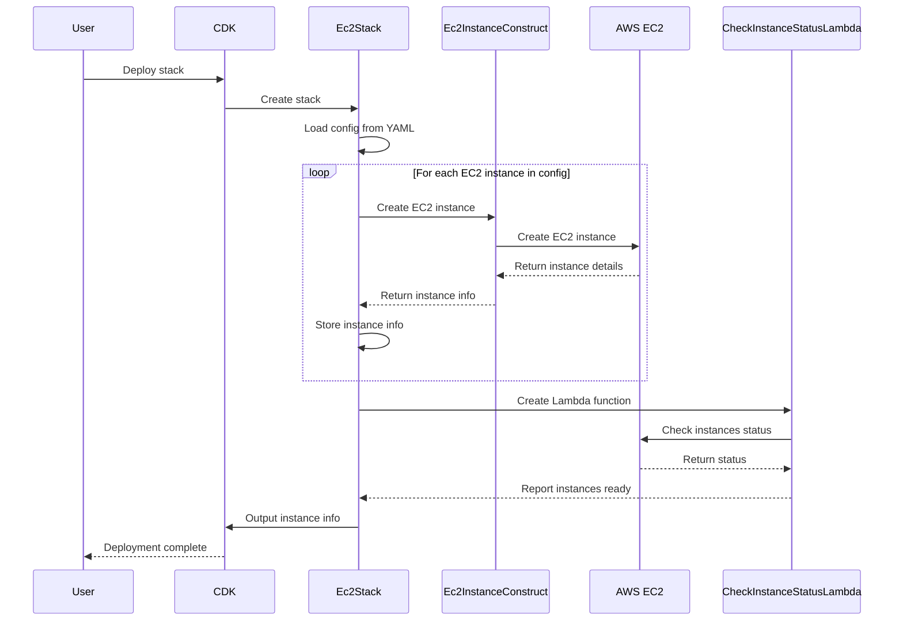

# DR Automation Project

## Project Overview

This project leverages AWS CDK with TypeScript to automate cloud resource provisioning for disaster recovery. It streamlines environment setup and management in AWS, ensuring swift recovery in disaster scenarios.



## Table of Contents

- [DR Automation Project](#dr-automation-project)
  - [Project Overview](#project-overview)
  - [Table of Contents](#table-of-contents)
  - [Prerequisites (first-time setup only)](#prerequisites-first-time-setup-only)
  - [First-Time Setup](#first-time-setup)
    - [Install Global Dependencies](#install-global-dependencies)
  - [AWS Account Setup](#aws-account-setup)
    - [Login to AWS via SSO](#login-to-aws-via-sso)
    - [Test AWS Access](#test-aws-access)
  - [Git Repository](#git-repository)
  - [Using the Project](#using-the-project)
  - [Deploying EC2 Instances](#deploying-ec2-instances)
  - [Verification](#verification)
  - [Adding an Instance to Target Group](#adding-an-instance-to-target-group)
  - [Cleaning Up](#cleaning-up)
    - [Automated Cleanup](#automated-cleanup)
    - [What Gets Removed](#what-gets-removed)
    - [Manual Cleanup Required](#manual-cleanup-required)
    - [Verification Steps](#verification-steps)
  - [Maintenance and Updates](#maintenance-and-updates)
  - [Troubleshooting](#troubleshooting)

## Prerequisites (first-time setup only)

Ensure the following are installed on your system:

1. **Python** (3.9.x or above)
2. **Node.js** (latest LTS version)
3. **NPM** (comes with Node.js)
4. **AWS CLI** (latest version)
5. **AWS CDK CLI** (latest version)
6. **AWS Session Manager Plugin**
7. **jq**

## First-Time Setup

### Install Global Dependencies

Run the following command to install necessary global dependencies:

```bash
npm install -g aws-cdk@2.151.0
```

## AWS Account Setup

Skip this section if you already have an AWS account set up.

### Login to AWS via SSO

If you have an existing AWS SSO profile:

```bash
aws sso login --profile your-aws-sso-profile-name
```

For new SSO setup:

1. Log in to AWS via MS365 or Office.com AWS app and copy the URL from the AccessKeys link.
2. Open a terminal and run:

```bash
aws configure sso
```

Follow the prompts, providing the necessary information (this info is available on your AWS account landing page), then make sure profile has been created once finished setting up your sso profile:

```bash
cat ~/.aws/config
```


### Test AWS Access

Verify your AWS access:

```bash
aws s3 ls --profile your-aws-sso-profile-name
```

## Git Repository

1. Clone the repository (use 'dr-automation' as folder name):
   ```bash
   git clone [repository-url]
   cd dr-automation
   ```

2. Install project dependencies:
   ```bash
   npm install
   ```

## Using the Project

The project is available on an EC2 instance named 'dr-automation-solution' in the DEV environment.

1. Connect to the instance (replace i-1234567 with real instance id):
   ```bash
   aws ssm start-session --target i-1234567 --profile your-aws-sso-profile-name --region ca-central-1
   ```

2. Once connected, run:
   ```bash
   sudo su - ec2-user
   cd dr-automation
   aws sso login --profile your-aws-sso-profile-name
   ```

## Deploying EC2 Instances

1. Navigate to the project directory:
   ```bash
   cd dr-automation
   ```

2. Edit `ec2-config.yaml`:
   - Update AMI IDs based on AWS Backup job results
   - Modify instance types or other parameters as needed

3. Bootstrap CDK.
   
   First you need make sure the bucket name you are using does not exist, so check in S3 console to make sure it's not present
   before running this command, otherwise you may get an error indicating 'bucket already exists'.
   
   ```bash
   ./cdk-bootstrap.sh your-aws-sso-profile-name
   ```

4. Synthesize the stack:
   ```bash
   cdk synth
   ```

5. Deploy the stack:
   
   ```bash
   ./cdk-deploy.sh your-aws-sso-profile-name
   ```

   The deployment output will be saved in `deployment_output_yyyymmdd_hhmm.out`.

## Verification

After deployment, perform these basic tests:

1. Verify EC2 instance accessibility:
   
   ```bash
   ./list-ec2.sh your-aws-sso-profile-name | grep running
   ```

2. Check CloudWatch for any error logs or metrics

3. Attempt to connect to an instance using Systems Manager:
   
   ```bash
   aws ssm start-session --target i-1234567 --profile your-aws-sso-profile-name
   ```

## Adding an Instance to Target Group

You will need to add one instance at a time to its corresponding target group. Follow these steps:

1. Find the target group by searching for the matching instance name (e.g., 'Gateway' or 'Couchebase'):
```bash
./describe-target-groups.sh your-aws-sso-profile-name InstanceName
```

2. From the output, note down two important pieces of information:
   - Target Group ARN
   - Port number from the registered instances (not the target group port)

Example output:
```json
[
  {
    "Target Group Name": "JBOC-Gateway-HTTPS",
    "Target Group ARN": "arn:aws:elasticloadbalancing:ca-central-1:1234567:targetgroup/JBOC-Gateway-HTTPS/54e19ae3d3033fda",  # <-- Copy this ARN
    "Port": 443,
    "Protocol": "HTTPS",
    "VPC ID": "vpc-1234567",
    "Target Type": "instance",
    "Registered Instances": [
      {
        "Instance ID": "i-1234567",
        "Port": 12345,  # <-- Copy this port number
        "Health State": "healthy",
        "Health Description": null,
        "Instance Name": "Gateway - Tomcat"
      }
    ]
  }
]
```

3. Find the instance ID of the new instance you want to register:
```bash
./list-ec2.sh your-aws-sso-profile-name
```

4. Register the instance using the collected information:
```bash
./register-target.sh your-aws-sso-profile-name target-group-arn instance-id port-number
```

Example:
```bash
./register-target.sh 1234567 arn:aws:elasticloadbalancing:ca-central-1:1234567:targetgroup/TargetGroupName/12345678 i-12345678 12345
```

5. Repeat steps 1-4 for each instance that needs to be registered.

**Note**: Make sure to use the port number from the registered instances section (12345 in the example) and not the target group port (443 in the example).

## Cleaning Up

### Automated Cleanup
To remove the entire stack and associated resources:

```bash
./destroy-and-cleanup.sh your-aws-sso-profile-name
```

### What Gets Removed
The cleanup script will automatically remove:
- CloudFormation stack and its resources
- EC2 instances
- Lambda functions
- IAM roles and policies created by the stack

### Manual Cleanup Required
**Important**: The following resources must be cleaned up manually:

1. **EBS Volumes**: 
   - Navigate to EC2 > Volumes in the AWS Console
   - Identify volumes that were attached to your terminated instances
   - Select and delete these volumes to avoid ongoing storage costs

2. **S3 Bucket**: 
   - Navigate to S3 in the AWS Console
   - Find the bucket matching the `bootstrap_s3_bucket_name` in your `ec2-config.yaml`
   - First empty the bucket contents
   - Then delete the empty bucket

### Verification Steps
After running the cleanup:
1. Verify that the CloudFormation stack has been deleted
2. Check EC2 dashboard for any remaining instances
3. Review and delete any remaining EBS volumes
4. Confirm that the bootstrap S3 bucket has been emptied and deleted

**Note**: If you encounter any errors during the cleanup process, please check the CloudFormation console for detailed error messages and ensure you have the necessary permissions.

## Maintenance and Updates

1. Regularly update the AWS CDK and other dependencies:
   ```bash
   npm update
   ```

2. Check for AWS service updates that might affect the solution.

3. Review and update the `ec2-config.yaml` file periodically to ensure it reflects current requirements.

## Troubleshooting

Common issues and solutions:

1. **CDK deployment fails**: 
   - Ensure you have the latest CDK version installed
   - Check AWS credentials and permissions
   - Review CloudFormation events in the AWS Console

2. **Unable to connect to EC2 instances**: 
   - Verify VPC and security group settings
   - Check instance status in EC2 dashboard
   - Ensure Systems Manager Agent is running on the instance

3. **AWS SSO login issues**: 
   - Clear browser cookies and cache
   - Verify your SSO credentials
   - Check if your SSO session has expired