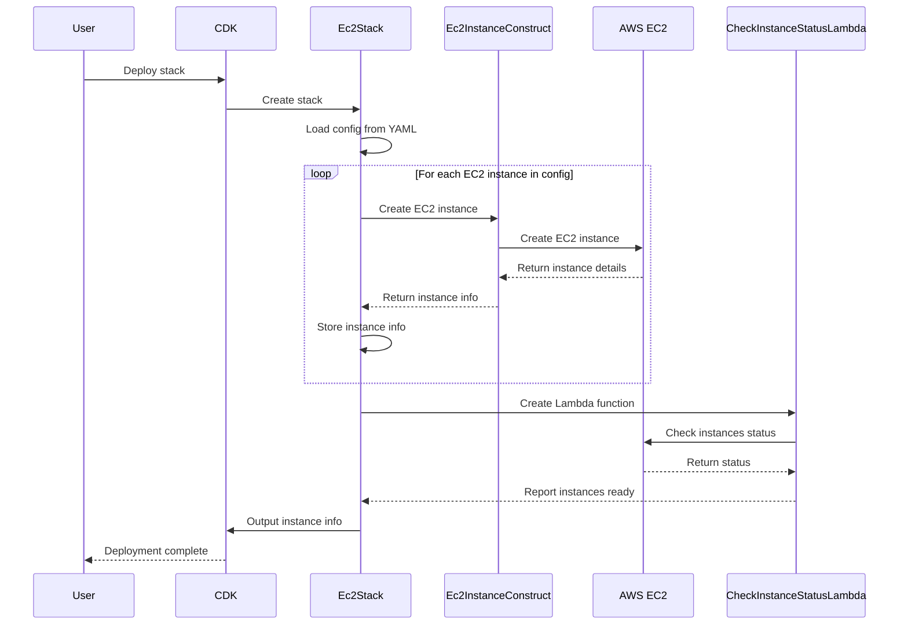

# DR Automation Project

## Project Overview

The DR (Disaster Recovery) Automation Project uses AWS CDK with TypeScript to automate the provisioning of cloud resources for disaster recovery scenarios. This solution aims to simplify and streamline the process of setting up and managing DR environments in AWS.



## Table of Contents

- [DR Automation Project](#dr-automation-project)
  - [Project Overview](#project-overview)
  - [Table of Contents](#table-of-contents)
  - [Prerequisites (applies to first-time setup)](#prerequisites-applies-to-first-time-setup)
  - [First-Time Setup](#first-time-setup)
    - [Install Global Dependencies](#install-global-dependencies)
  - [AWS Account Setup](#aws-account-setup)
    - [Login to AWS via SSO](#login-to-aws-via-sso)
    - [Test AWS Access](#test-aws-access)
  - [Local Development Environment](#local-development-environment)
  - [Using the DR Automation Solution in DEV](#using-the-dr-automation-solution-in-dev)
  - [Deploying EC2 Instances](#deploying-ec2-instances)
  - [Testing](#testing)
  - [Cleaning Up](#cleaning-up)
  - [Maintenance and Updates](#maintenance-and-updates)
  - [Troubleshooting](#troubleshooting)

## Prerequisites (applies to first-time setup)

Ensure the following are installed on your system:

1. **Python** (3.9.x or above)
2. **Node.js** (latest LTS version)
3. **NPM** (comes with Node.js)
4. **AWS CLI** (latest version)
5. **AWS CDK CLI** (latest version)
6. **AWS Session Manager Plugin**  
   [Installation Guide](https://docs.aws.amazon.com/systems-manager/latest/userguide/session-manager-working-with-install-plugin.html)

## First-Time Setup

### Install Global Dependencies

Run the following command to install necessary global dependencies:

```bash
npm install -g aws-cdk@2.151.0
```

## AWS Account Setup

Skip this section if you already have an AWS account set up.

### Login to AWS via SSO

If you have an existing AWS SSO profile:

```bash
aws sso login --profile your-profile-name
```

For new SSO setup:

1. Log in to AWS via MS365 or Office.com AWS app and copy the URL from the AccessKeys link.
2. Open a terminal and run:

```bash
aws configure sso
```

3. Follow the prompts, providing the necessary information.

### Test AWS Access

Verify your AWS access:

```bash
aws s3 ls --profile your-profile-name
```

Ensure the `~/.aws/` directory contains the required configuration files:

```bash
ls -lrt ~/.aws/
```

## Local Development Environment

1. Clone the repository (use your preferred method, i.e. VS Code, Git Desktop, etc.):
   ```bash
   git clone [repository-url]
   cd dr-automation
   ```

2. Install project dependencies:
   ```bash
   npm install
   ```

## Using the DR Automation Solution in DEV

The project is available on an EC2 instance named 'dr-automation-solution' in the DEV environment (replace i-1234567 with real instance id).

1. Connect to the instance:
   ```bash
   aws ssm start-session --target i-1234567 --profile your-profile-name --region ca-central-1
   ```

2. Once connected, run:
   ```bash
   sudo su - ec2-user
   cd dr-automation
   aws sso login --profile your-profile-name
   ```

## Deploying EC2 Instances

1. Navigate to the project directory:
   ```bash
   cd dr-automation
   ```

2. Edit `ec2-config.yaml`:
   - Update AMI IDs based on AWS Backup job results
   - Modify instance types or other parameters as needed

3. Bootstrap CDK (replace 'your-bucket-name' with the bootstrap name to match the name defined in ec2-config.yaml):
   ```bash
   cdk bootstrap --cloudformation-execution-policies arn:aws:iam::aws:policy/AdministratorAccess aws://ACCOUNT-ID/ca-central-1 --profile your-profile-name --bootstrap-bucket-name your-bucket-name
   ```

4. Synthesize the stack:
   ```bash
   cdk synth
   ```

5. Deploy the stack:
   
   On Amazon Linux (EC2 AMI):
   ```bash
   script -c "cdk deploy --require-approval broadening --profile your-profile-name" deployment_output.out
   ```

   On Mac:
   ```
   script deployment_output.out cdk deploy --profile your-profile-name
   ```

   The deployment output, including instance IDs and IP addresses, will be saved in `deployment_output.out`.

   Run script "extract-instance-info-from-output-file.sh" to extract the instances info into a JSON file, output will be stored in 'instance_info.json'.

## Testing

After deployment, perform these basic tests:

1. Verify EC2 instance accessibility:
   ```bash
   aws ec2 describe-instances --profile your-profile-name
   ```

2. Check CloudWatch for any error logs or metrics

3. Attempt to connect to an instance using Systems Manager:
   ```bash
   aws ssm start-session --target i-1234567 --profile your-profile-name
   ```

## Cleaning Up

To remove the stack and associated resources:

```bash
./destroy-and-cleanup.sh your-profile-name
```

## Maintenance and Updates

1. Regularly update the AWS CDK and other dependencies:
   ```bash
   npm update
   ```

2. Check for AWS service updates that might affect the DR solution.

3. Review and update the `ec2-config.yaml` file periodically to ensure it reflects current requirements.

## Troubleshooting

Common issues and solutions:

1. **CDK deployment fails**: 
   - Ensure you have the latest CDK version installed
   - Check AWS credentials and permissions
   - Review CloudFormation events in the AWS Console

2. **Unable to connect to EC2 instances**: 
   - Verify VPC and security group settings
   - Check instance status in EC2 dashboard
   - Ensure Systems Manager Agent is running on the instance

3. **AWS SSO login issues**: 
   - Clear browser cookies and cache
   - Verify your SSO credentials
   - Check if your SSO session has expired